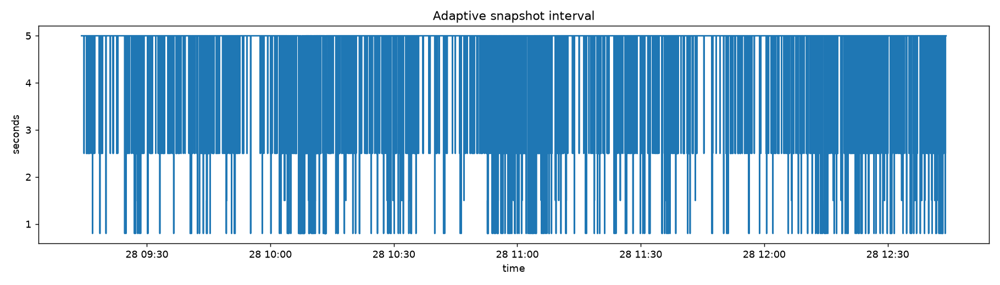

# Market Data Intelligence Lab

**From a deliberately simple grid bot to a research pipeline for a separate short-horizon signal bot.**

> **Research question:** can market microstructure reveal a developing formation *before* the price pattern is fully confirmed — early enough to support a separate signal-driven trading system?

To answer that question, I first had to build the data infrastructure capable of capturing those moments reliably.

```mermaid
flowchart LR
    G[Grid bot experiments] --> L[Lesson: more signals did not make the grid meaningfully better]
    L --> S[Separate signal-bot hypothesis]
    S --> D[Need high-resolution market data]
    D --> B[Fixed 1 s collector]
    B --> R[Dense reference recorder]
    R --> A[Adaptive sampling research]
    A --> C[Adaptive collector]
    B --> ML[Streaming ML research]
    C --> ML
    ML --> P[Formation / pre-confirmation predictor research]
    P -. future integration .-> SB[Short-horizon signal bot]
```



The important architectural decision was to **stop forcing predictive intelligence into the grid strategy**. Repeated attempts added complexity to the infrastructure without producing enough benefit to justify it. Instead, the predictive problem was separated into its own research track: collect the right data, define formations and outcomes, validate temporal models correctly, and only then consider a signal-driven execution layer.

That change of direction is the reason this repository exists.

## The first engineering result: collect less, preserve what matters

Before building a useful microstructure predictor, the data pipeline itself had to become more selective. A full L50 order-book snapshot every second is simple, but it spends exactly the same storage budget on dead markets and violent markets.

The adaptive-sampling experiment produced the following result on a chronological frozen holdout:

| Published holdout result | Value |
|---|---:|
| Full L50 snapshots vs fixed 1 s baseline | **-72.73%** |
| Tier A event recall | **100%** |
| Tier B event recall | **100%** |
| Tier A snapshot recall | **100%** |
| Tier B snapshot recall | **94.44%** |
| Reaction p95 | **250 ms** |
| Acceptance gates | **9 / 9 passed** |


The result comes from a chronological holdout of a single frozen market session. It is a real experimental result, but **not evidence that the same performance holds across every market regime**. Multi-day / multi-regime validation remains an obvious next step.



## The engineering story

This repository consolidates five stages of one R&D path rather than presenting them as unrelated scripts.

### 1 — Baseline: collect everything at a fixed cadence

The first collector reconstructed Spot + Perpetual L50 books continuously and persisted a full order-book snapshot every second when the book changed. It also captured every public trade and liquidation and rotated raw JSONL into verified compressed archives.

That gave me a usable dataset, but it treated quiet and violent market periods as equally valuable.

### 2 — Build a dense reference stream

A separate recorder captured transport-level order-book snapshots/deltas, trades and liquidations into 15-minute archives. Offline replay reconstructs the market at a 250 ms research clock.

This creates a dense reference against which sparse/adaptive sampling policies can be judged instead of tuning them by intuition.

### 3 — Research the sampling policy

The v0.4 experiment measures six microstructure sensors:

- price range,
- tick travel,
- trade rate,
- quote volume,
- order-book churn,
- imbalance delta.

The study searched **480 adaptive policies** across decay constants, gains, transforms, sensor-weight families and response profiles. Two fixed baselines were retained for comparison. Only **11 / 480 adaptive candidates** passed all nine quality gates in the calibration phase.

The winner was frozen before the holdout evaluation.

### 4 — Put the research result back into the collector

The validated policy was implemented in a production-candidate collector:

| Regime | Full L50 persistence interval |
|---|---:|
| QUIET | 5000 ms |
| NORMAL | 2500 ms |
| ACTIVE | 1500 ms |
| EXTREME | 800 ms |

Trades and liquidations are **never adaptively dropped**; only the persistence frequency of full reconstructed L50 snapshots changes.

Each adaptive snapshot carries metadata such as policy, mode, interval, heat, reason and calibration ID. That matters because non-uniform sampling can otherwise become a hidden selection bias in later ML experiments.

### 5 — Build the predictive research layer

The Python research engine consumes raw `.tar.gz` archives as a stream instead of materializing one giant merged dataset. It reduces tick/order-book data into minute partitions, enriches them with public historical series, detects candidate market structures, builds features and labels future outcomes.

The long-term hypothesis is deliberately narrower than "predict Bitcoin":

> **Can the state of the order book and surrounding market variables immediately before a formation is confirmed contain enough information to estimate whether the setup is worth acting on?**

The intended consumer of such a predictor is **not the grid bot**. It is a separate short-horizon signal bot whose entries would be driven by a validated model rather than by adding more complexity to the grid strategy.

The ML layer includes:

- `HistGradientBoostingClassifier`,
- probability calibration with logistic regression,
- `HistGradientBoostingRegressor` for MFE/MAE ranges,
- chronological selection/holdout split,
- walk-forward validation,
- embargo equal to the maximum label horizon,
- Brier score, log loss, ROC AUC and Average Precision,
- permutation importance,
- ablation: `historical_backfillable_only` vs `full_microstructure`.

The repository intentionally **does not claim a profitable predictive model or a finished signal bot**. The supplied source bundle contains the research engine and synthetic end-to-end smoke tests, but no published real-market champion model output. The value here is the progression from hypothesis → data acquisition → experiment design → temporal validation → deployable data policy → predictive research infrastructure.

## Why the ML experiment is interesting

A central question is whether expensive microstructure data actually adds predictive information beyond cheap historical inputs that can be backfilled later.

The engine therefore compares:

```text
historical_backfillable_only
vs
full_microstructure
```

This makes the cost of collecting order-book/tick data an empirical question. If the extra data does not improve out-of-sample prediction, the collector should not keep paying for it. If it does, the adaptive acquisition layer provides a way to concentrate storage on the periods where the information is most valuable.

## Repository map

```text
01-baseline-collector/           fixed 1 s market-data collector
02-dense-reference-recorder/    dense transport recorder for experiments
03-adaptive-sampling-research/  replay, calibration, 480-policy search, holdout
04-adaptive-collector/           validated policy deployed back into collector
05-ml-research-engine/           streaming feature/label/ML research pipeline

docs/
  ARCHITECTURE.md
  EVOLUTION.md
  EXPERIMENT_DESIGN.md
  ML_METHODOLOGY.md
  RESULTS.md
  SIGNAL_BOT_HYPOTHESIS.md
  REPRODUCIBILITY.md
  GITHUB_SETUP.md
```

## Automated verification

The GitHub Actions workflow is intentionally split by responsibility:

- baseline collector: `npm ci`, syntax checks and Node tests,
- dense recorder: deterministic install and syntax check,
- adaptive collector: syntax + sampler/orderbook/archive/calibration tests,
- adaptive research: Python unit tests,
- ML research: Python unit tests + synthetic streaming smoke pipeline,
- repository contracts: published holdout metrics, result arithmetic and research→collector calibration lineage.

Across the consolidated repo, the included suites currently execute **35 automated tests** plus a synthetic streaming ML smoke pipeline and repository/result contract checks.

The CI does **not** call live Bybit endpoints and does not need exchange credentials.

## Quick verification

Node components:

```bash
cd 01-baseline-collector && npm ci && npm test && npm run check
cd ../02-dense-reference-recorder && npm ci && npm run check
cd ../04-adaptive-collector && npm ci && npm test && npm run check
```

Python research:

```bash
python -m pip install -r 03-adaptive-sampling-research/research/requirements.txt
cd 03-adaptive-sampling-research/research
python -m unittest discover -s tests -v
```

ML research:

```bash
python -m pip install -r 05-ml-research-engine/requirements.txt
cd 05-ml-research-engine
python -m unittest discover -s tests -v
python smoke_streaming.py
```

Published-result contracts:

```bash
python scripts/verify_published_results.py
python scripts/repository_sanity.py
```

## What is deliberately not in this repo

- raw market archives,
- API keys or private credentials,
- local logs/cache/output datasets,
- trained real-market model artifacts that were not present in the supplied source bundle,
- a finished live signal-trading implementation.

This keeps the repository small, reviewable and honest about what can and cannot be reproduced from public files alone.

## Status

Portfolio / research repository. The adaptive sampling result is a validated single-session experiment; the ML engine is research infrastructure; the signal bot is the intended downstream research direction, not a production-ready claim.

Nothing here should be interpreted as financial advice or as evidence of profitable live-trading performance.

See [docs/SIGNAL_BOT_HYPOTHESIS.md](docs/SIGNAL_BOT_HYPOTHESIS.md) for the project motivation and [docs/RESULTS.md](docs/RESULTS.md) for the exact published adaptive-sampling metrics and limitations.
