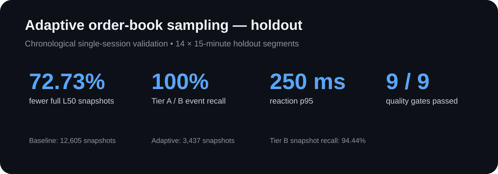

# Market Data Intelligence Lab

Repozytorium dokumentuje rozwój systemu od prostego collectora danych rynkowych do eksperymentalnego pipeline'u machine learning przygotowanego pod przyszłego bota sygnałowego.

Projekt powstał jako kolejny etap prac nad [BOT_EU](https://github.com/CKportfolio/BOT_EU).

W grid bocie testowane były kolejne mechanizmy mające uczynić strategię bardziej „świadomą rynku”. W praktyce dokładanie następnych warstw informacji zwiększało głównie złożoność systemu, bez przekonującego dowodu, że daje proporcjonalną poprawę działania samego gridu.

Z tego powstała decyzja:

> **nie komplikować dalej strategii gridowej, tylko oddzielić od niej problem predykcji.**

Nowym celem stał się osobny bot sygnałowy, który w przyszłości mógłby wykorzystywać model ML do rozpoznawania sytuacji pojawiającej się bezpośrednio przed potwierdzeniem krótkoterminowej formacji cenowej.

Żeby taki pomysł można było w ogóle zbadać, najpierw potrzebne były odpowiednie dane.

---

## Co właściwie zbieramy?

Oprócz zwykłych danych o cenie projekt zapisuje także **orderbook**.

Orderbook można najprościej wyobrazić sobie jako bieżącą listę:

- „chcę kupić po tej cenie”,
- „chcę sprzedać po tej cenie”.

Na giełdzie takich zleceń są tysiące i cały czas się zmieniają.

Przykład:

```text
SPRZEDAŻ

101.00   2.1 BTC
100.90   0.8 BTC
100.80   1.4 BTC

----------------
aktualna cena
----------------

100.70   1.8 BTC
100.60   3.2 BTC
100.50   0.6 BTC

KUPNO
```

Wykres ceny pokazuje przede wszystkim **to, co już się wydarzyło**.

Orderbook pozwala dodatkowo zobaczyć, co dzieje się wokół ceny:

- gdzie czekają zlecenia,
- czy któraś strona rynku zaczyna przeważać,
- czy płynność nagle znika,
- czy pojawia się większa aktywność.

W skrócie:

> **wykres pokazuje ruch ceny, a orderbook pomaga zobaczyć, co działo się wokół niej chwilę wcześniej.**

To właśnie te dane mają być później analizowane przez modele ML.

---

# Ewolucja projektu

```text
GRID BOT
   │
   │ dokładanie kolejnych warstw logiki
   ▼
większa złożoność
bez wyraźnej przewagi
   │
   ▼
oddzielenie problemu predykcji
   │
   ▼
SIGNAL BOT — hipoteza
   │
   ▼
potrzeba własnych danych
   │
   ▼
01. BASELINE COLLECTOR
   │
   ▼
02. DENSE REFERENCE RECORDER
   │
   ▼
03. ADAPTIVE SAMPLING RESEARCH
   │
   ▼
04. ADAPTIVE COLLECTOR
   │
   ▼
05. ML RESEARCH ENGINE
```

---

# 01 — Baseline Collector

Pierwsza wersja collectora zapisywała pełny snapshot 50 najbliższych poziomów orderbooka mniej więcej **co 1 sekundę**.

Zbierane były również m.in.:

- trades,
- zmiany orderbooka,
- liquidations,
- dodatkowe dane rynkowe.

Podejście było proste:

> **najpierw zbierzmy możliwie dużo danych.**

Problem:

collector zapisywał dokładnie tak samo intensywnie zarówno rynek spokojny, jak i bardzo aktywny.

---

# 02 — Dense Reference Recorder

Najprostsze rozwiązanie problemu storage byłoby banalne:

> zamiast snapshotu co sekundę, zapisywać np. co 5 sekund.

Tylko że wtedy można zgubić krótkie epizody, które później mogą być najważniejsze dla modelu.

Dlatego powstał gęsty recorder referencyjny.

Pozwala on odtwarzać wcześniej zebrany fragment rynku offline z wysoką rozdzielczością i sprawdzać:

> **jak zachowałby się collector przy różnych strategiach próbkowania?**

Dzięki temu nie trzeba testować każdej konfiguracji na żywym rynku.

---

# 03 — Adaptive Sampling Research

Celem było zbudowanie collectora, który:

- zwalnia, kiedy rynek jest spokojny,
- przyspiesza, kiedy zaczyna dziać się więcej.

Sampler obserwuje m.in.:

- tempo transakcji,
- zakres ruchu ceny,
- aktywność orderbooka,
- obrót,
- zmianę nierównowagi pomiędzy stroną kupującą i sprzedającą.

Na tej podstawie wybiera częstotliwość pełnego snapshotu.

Przykładowa zwycięska konfiguracja:

| Stan rynku | Snapshot |
|---|---:|
| QUIET | **5.0 s** |
| NORMAL | **2.5 s** |
| ACTIVE | **1.5 s** |
| EXTREME | **0.8 s** |

Czyli:

```text
spokojny rynek  → mniej danych
aktywny rynek   → więcej danych
```

---

## Eksperyment

Nie dobierano parametrów ręcznie.

Przetestowanych zostało:

**480 konfiguracji**

Dane podzielono chronologicznie:

```text
70% calibration
5% gap
25% untouched holdout
```

Najlepsza konfiguracja została wybrana tylko na części calibration.

Następnie została zamrożona i dopiero wtedy sprawdzona na końcowym holdoucie.

---

## Wynik

Na badanym holdoucie:

| Metryka | Wynik |
|---|---:|
| Redukcja pełnych snapshotów L50 | **72.73%** |
| Tier A event recall | **100%** |
| Tier B event recall | **100%** |
| Tier A snapshot recall | **100%** |
| Tier B snapshot recall | **94.44%** |
| Reaction time p95 | **250 ms** |
| False-fast time | **4.00%** |
| Acceptance gates | **9 / 9** |

Baseline:

```text
12 605 snapshotów
```

Adaptive sampler:

```text
3 437 snapshotów
```



Najważniejszy wniosek nie brzmi więc tylko:

> „udało się zmniejszyć ilość danych”.

Bardziej interesujące jest:

> **udało się znacząco zmniejszyć ilość pełnych snapshotów, zachowując najważniejsze wykrywane epizody rynku w badanym okresie.**

To właśnie takie fragmenty danych są potencjalnie najbardziej wartościowe dla późniejszego ML.

---

# 04 — Adaptive Collector

Wynik badania został następnie przeniesiony do kolejnej wersji rzeczywistego collectora.

Collector zapisuje również informację o tym, dlaczego w danym momencie użył konkretnej częstotliwości:

```text
policy
mode
regime
interval
heat
reason
calibrationId
```

To ma znaczenie dla późniejszej analizy.

Jeżeli aktywny rynek jest zapisywany częściej niż spokojny, dataset nie jest próbkowany równomiernie.

Model ML powinien mieć możliwość uwzględnienia tego faktu.

---

# 05 — ML Research Engine

Ostatni etap projektu służy już bezpośrednio badaniu hipotezy przyszłego bota sygnałowego.

Pytanie brzmi:

> **czy bezpośrednio przed potwierdzeniem określonej formacji w danych rynkowych pojawia się sygnał, który model może rozpoznać wcześniej?**

Nie chodzi o przewidywanie całego rynku ani przyszłej ceny BTC.

Badany jest znacznie węższy problem:

```text
interesująca formacja
        ↑
co działo się 10–30 sekund wcześniej?
```

Pipeline analizuje m.in. zachowanie:

- ceny,
- transakcji,
- orderbooka,
- aktywności rynku,
- wybranych danych dodatkowych.

---

## Modele

W projekcie wykorzystywane są m.in.:

```text
HistGradientBoostingClassifier
HistGradientBoostingRegressor
LogisticRegression
```

Model nie jest jednak najważniejszą częścią eksperymentu.

W danych rynkowych dużo łatwiej uzyskać pozornie świetny wynik przez błędną walidację niż przez naprawdę dobry model.

Dlatego projekt korzysta z:

```text
chronological splits
walk-forward validation
embargo
untouched holdout
```

Sens jest prosty:

> **model nie może przypadkiem dostać informacji z przyszłości.**

---

# Czy orderbook rzeczywiście jest potrzebny?

To jest jedno z ważniejszych pytań całego projektu.

Szczegółowe dane mikrostrukturalne są kosztowniejsze w zbieraniu i przechowywaniu niż zwykłe historyczne dane rynkowe.

Dlatego pipeline pozwala porównywać:

```text
historical_backfillable_only
```

z:

```text
full_microstructure
```

Czyli:

> **czy dodanie orderbooka naprawdę poprawia jakość predykcji?**

Jeżeli nie — zbieranie go może nie być warte dodatkowej infrastruktury.

To kontynuuje zasadę, od której zaczął się cały projekt:

> **większa złożoność ma sens tylko wtedy, kiedy można pokazać, że coś wnosi.**

---

# Decyzje inżynierskie

| Punkt wyjścia | Problem | Decyzja |
|---|---|---|
| Rozbudowywanie grid bota | Większa złożoność nie dawała wyraźnej przewagi | Oddzielić grid od systemu predykcyjnego |
| Pomysł signal bota | Brak odpowiednich danych historycznych | Zbudować własny collector |
| Snapshot co 1 sekundę | Dużo danych z nieaktywnych okresów | Zbadać adaptive sampling |
| Stałe wolniejsze próbkowanie | Ryzyko utraty krótkich ważnych zdarzeń | Dense reference recorder |
| Ręczne progi | Trudno obiektywnie ocenić konfigurację | Test 480 wariantów |
| Wynik eksperymentu | Sam wynik nie zmienia działającego systemu | Wdrożyć winnera do collectora |
| ML na danych czasowych | Ryzyko leakage | Walk-forward + embargo |
| Duża liczba danych | Nie wiadomo, które naprawdę są potrzebne | Feature-group comparison |

Cała ewolucja projektu sprowadza się do:

```text
problem
   ↓
eksperyment
   ↓
wynik
   ↓
decyzja
   ↓
kolejna wersja systemu
```

---

# Struktura repozytorium

```text
market-data-intelligence-lab/
│
├── 01-baseline-collector/
│   └── collector ze stałym snapshotem
│
├── 02-dense-reference-recorder/
│   └── zapis referencyjny do eksperymentów
│
├── 03-adaptive-sampling-research/
│   └── testowanie i wybór polityki adaptive sampling
│
├── 04-adaptive-collector/
│   └── collector wykorzystujący wynik badania
│
├── 05-ml-research-engine/
│   └── pipeline eksperymentalny machine learning
│
├── docs/
│   └── dokumentacja badań
│
├── scripts/
│   └── automatyczna kontrola repo i wyników
│
└── .github/
    └── CI + Dependabot
```

---

# Testy i CI

Repo posiada automatyczny pipeline GitHub Actions.

Testowane są m.in.:

- rekonstrukcja orderbooka,
- rotacja i łączenie danych,
- adaptive sampler,
- konfiguracja calibration,
- generowanie datasetu,
- labelowanie,
- ochrona przed lookahead,
- walk-forward i embargo,
- streaming danych,
- pełny syntetyczny smoke test pipeline'u ML.

Pierwsze uruchomienie CI znalazło również rzeczywisty edge case:

cecha mogła być zmienna w całym datasetcie, ale stała w pojedynczym foldzie treningowym.

Pipeline ML został poprawiony tak, aby takie cechy były wykrywane przed treningiem, a przypadek został objęty testem regresyjnym.

---

# Czego repo nie udowadnia

Projekt nie oznacza, że:

- istnieje już skuteczny predictor formacji,
- signal bot jest gotowy,
- model generuje zysk,
- orderbook na pewno wnosi predictive value,
- wynik adaptive sampling będzie taki sam w każdym reżimie rynku.

Obecny status:

```text
Baseline collector            ✓
Dense recorder                ✓
Adaptive sampling research    ✓
Adaptive collector            ✓
ML research pipeline          ✓
Signal predictor              R&D
Signal bot                    not implemented
```

---

# Kolejne kroki

Najważniejsze dalsze eksperymenty:

```text
multi-day validation
multi-regime validation
formation-specific labeling
feature-group ablation
microstructure contribution analysis
probability calibration
transaction-cost-aware evaluation
paper-trading integration
```

Dopiero wynik powtarzalny na wielu okresach rynku uzasadniałby podłączenie modelu do modułu wykonawczego.

---

# Dokumentacja

Szczegółowe informacje:

- `docs/EVOLUTION.md`
- `docs/ARCHITECTURE.md`
- `docs/EXPERIMENT_DESIGN.md`
- `docs/RESULTS.md`
- `docs/ML_METHODOLOGY.md`
- `docs/SIGNAL_BOT_HYPOTHESIS.md`
- `docs/REPRODUCIBILITY.md`
- `SECURITY.md`

---

# Powiązany projekt

### [BOT_EU — Bybit.eu Grid Trading Bot](https://github.com/CKportfolio/BOT_EU)

BOT_EU pokazuje część wykonawczą i strategię gridową.

Market Data Intelligence Lab pokazuje kolejny kierunek:

> **zamiast dokładać predykcję do gridu, najpierw zbudować dane i sprawdzić, czy predykcyjna przewaga rzeczywiście istnieje.**

---

## License

Kod został udostępniony publicznie do celów portfolio, edukacji i technical review.

Szczegóły znajdują się w `LICENSE`.
