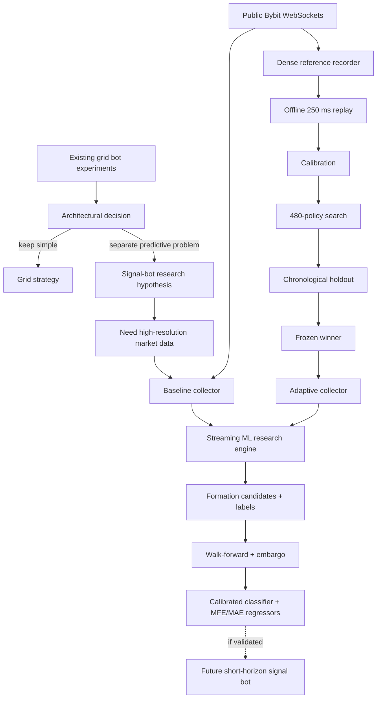

# Architecture

## System context

## Separation of concerns

The architecture deliberately separates four different problems:

1. **Execution strategy** — the existing grid bot is not the predictive research target.
2. **Acquisition** — capture enough market microstructure to study pre-confirmation behaviour.
3. **Sampling research** — reduce data volume without silently discarding the episodes that matter.
4. **Predictive ML research** — test whether those episodes contain useful out-of-sample information.

This separation is the core architectural lesson of the project: adding predictive layers directly to a grid strategy increased complexity without sufficient benefit, so predictive intelligence was moved into an independent research path.

## Data boundaries

The repository separates **acquisition**, **sampling research**, **deployment of the selected policy**, and **predictive ML research**. Adaptive sampling is not presented as machine learning; it is a research-validated control policy. The ML component is the scikit-learn research engine.

## Intended downstream contract

A future signal bot would consume model outputs only after the research layer establishes a stable, leakage-aware out-of-sample result. The current repository stops before that execution boundary and therefore makes no claim about live trading profitability.
