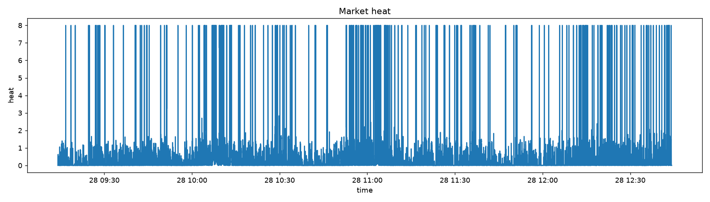

# Published adaptive-sampling result

## Calibration winner

`asym-sqrt_excess-price_heavy-clean_release-tau1000-g0.95`

Calibration: 11 of 480 adaptive candidates passed all nine gates. The selected winner achieved 69.14% snapshot reduction on calibration while preserving the required fidelity gates.

## Chronological holdout

| Metric | Holdout | Gate |
|---|---:|---:|
| Tier A event recall | 100.00% | >= 98% |
| Tier B event recall | 100.00% | >= 90% |
| A+B weighted recall | 100.00% | >= 95% |
| Tier A snapshot recall | 100.00% | >= 98% |
| Tier B snapshot recall | 94.44% | >= 90% |
| Reaction p95 | 250 ms | <= 750 ms |
| Oversampling p95 | 5.5 s | <= 6 s |
| False-fast time | 4.00% | <= 20% |
| Snapshot reduction | 72.73% | >= 40% |

Snapshot counts:

- fixed 1 s baseline: 12,605
- adaptive winner: 3,437
- reduction: 9,168 snapshots / 72.73%

Reconstruction diagnostics:

- mid-price reconstruction MAE: 0.1648 bp
- imbalance reconstruction MAE: 0.1683

## Limitations

The holdout consists of 14 consecutive 15-minute archives (~3.5 hours) from one frozen market session. The result is evidence for this experiment, not a universal market guarantee. A stronger follow-up would repeat the exact frozen protocol across multiple days, volatility regimes and market conditions.

The raw dense archives are not included in this repository, so the exact real-market replay cannot be independently reproduced from public files alone. The code, split manifest, winner config, leaderboard and holdout metrics are published.
